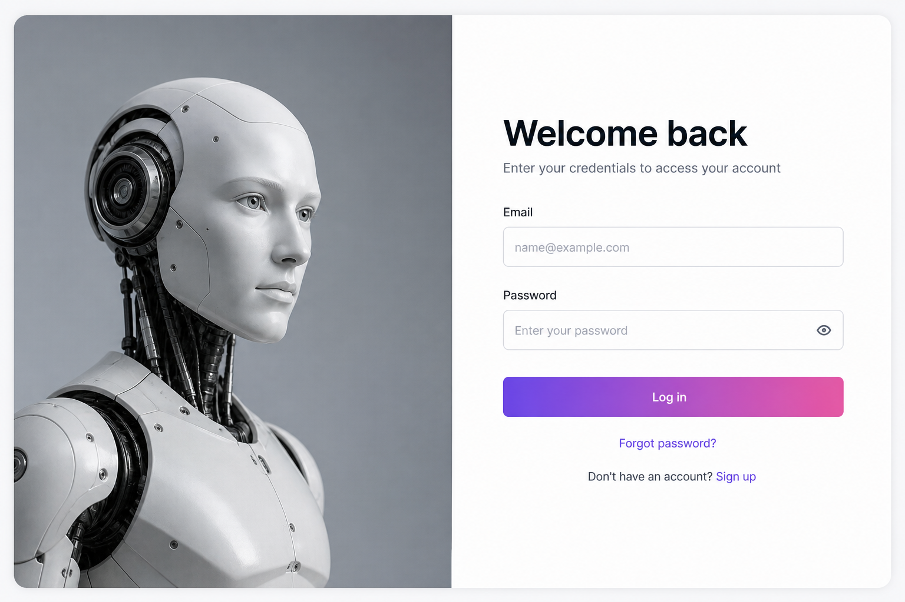
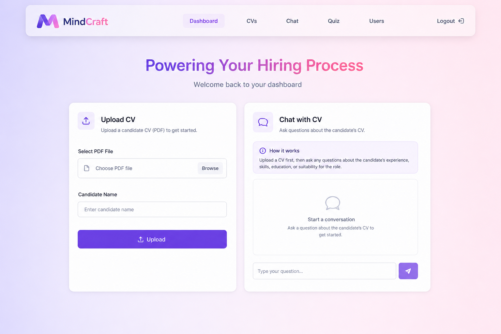
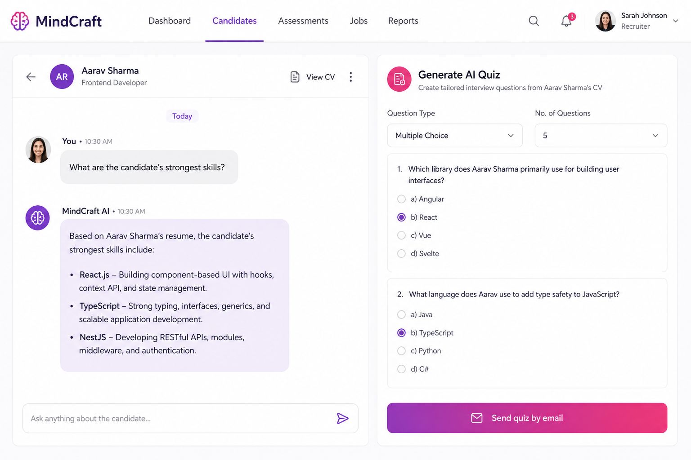

<div align="center">

# MindCraft — AI-Powered CV Analysis Platform

**Upload a resume. Chat with it. Generate an interview quiz.**

A recruitment tool that turns PDF CVs into searchable knowledge using embeddings, RAG chat, and AI-generated assessments.

[**Live demo**](https://ai-powered-cv-analysis-platform-bac-ten.vercel.app) · [Try with demo login](#try-the-app)

</div>

<p align="center">
  
  
  
  
  
</p>

---

## Try the app

**Demo:** [https://ai-powered-cv-analysis-platform-bac-ten.vercel.app](https://ai-powered-cv-analysis-platform-bac-ten.vercel.app)

| | |
|---|---|
| **Email** | `admin@craftmind.local` |
| **Password** | `Admin123!` |

Use this **admin** account — it is already verified. Creating a new account may fail email OTP if SendGrid is not configured.

The backend may sleep after idle time. If login takes ~1 minute the first time, wait and retry.

**What to try**

1. Sign in with the credentials above.
2. Upload a **PDF** resume.
3. Ask questions about the candidate (skills, experience, projects).
4. Generate an AI quiz from that CV.

---

## Screenshots

<p align="center">
  
  <br />
  <em>Sign in</em>
</p>

<p align="center">
  
  <br />
  <em>Dashboard — upload CVs and start chatting</em>
</p>

<p align="center">
  
  <br />
  <em>RAG chat on a CV and AI interview quiz</em>
</p>

---

## What it does

Recruiters often scan dozens of PDFs by hand. This platform indexes each resume so you can **ask questions in natural language** and **generate interview questions** from the same document.

| Feature | Detail |
|---------|--------|
| PDF upload | Extract text, chunk it, store embeddings |
| Chat with a CV | RAG: retrieve relevant chunks, then answer with GPT-4o-mini |
| Chat across CVs | Ask questions over all uploaded resumes |
| AI quizzes | Multiple-choice questions from a CV, email to candidates, auto-score |
| Auth | JWT, OTP email verification, admin vs user roles |

---

## How it works

```text
PDF  →  extract + chunk  →  Gemini embeddings  →  ChromaDB
                                              ↓
                         recruiter question  →  retrieve context  →  GPT-4o-mini
```

- **Frontend:** Next.js (React, Tailwind) — deployed on Vercel  
- **Backend:** NestJS — REST API (auth, CV, quiz, email)  
- **Vectors:** ChromaDB `0.5.23` (v1 API, matches the JS client)  
- **AI:** Gemini for embeddings, OpenAI for chat and quizzes  

---

## Run locally

**Need:** Node 22+, pnpm, Docker Desktop, and keys for Gemini, OpenAI and SendGrid.
All three are required — the API aborts startup if the SendGrid/SMTP variables
are missing.

```bash
git clone https://github.com/BkHassan/ai-powered-cv-analysis-platform.git
cd ai-powered-cv-analysis-platform
```

1. Copy [`.env.example`](.env.example) to `.env` and fill in your keys. For Docker:

```env
CHROMADB_URL=http://chromadb:8000
PORT=3003
FRONTEND_URL=http://localhost:3000
ADMIN_EMAIL=admin@craftmind.local
ADMIN_PASSWORD=Admin123!
```

2. Frontend:

```env
# apps/frontend/.env.local
NEXT_PUBLIC_API_URL=http://localhost:3003
```

3. Start backend + ChromaDB, then the UI:

```bash
docker compose up --build
```

```bash
cd apps/frontend
pnpm install
pnpm dev
```

Open [http://localhost:3000](http://localhost:3000) and log in with the same admin credentials.

---

## Repo layout

```text
apps/frontend   Next.js UI            (apps/frontend/Dockerfile)
apps/backend    NestJS API            (Dockerfile.backend, at the repo root)
deploy/         Caddyfile for the edge proxy

docker-compose.yml            local dev: backend + ChromaDB
docker-compose.backend.yml    prod: API + ChromaDB
docker-compose.frontend.yml   prod: Next.js server
docker-compose.proxy.yml      prod: Caddy, TLS and routing
```

---

## Deploy on a VPS

Frontend and backend run as two independent stacks behind Caddy, which
terminates TLS and routes by hostname. They deploy separately — the two only
meet in the browser, which calls the API directly over HTTPS.

```text
Internet ──▶ Caddy :443 ──┬── app.example.com ──▶ frontend:3000
                          └── api.example.com ──▶ backend:3003
                                                     │  back-tier (private)
                                                     └──▶ chromadb:8000
```

**Need:** a VPS with 4 GB RAM (a Next.js build gets OOM-killed below that),
Docker Engine with the Compose plugin, and A records for both hostnames
pointing at the server before you start the proxy — otherwise the Let's Encrypt
challenge fails.

**1. Clone the repo** using a read-only deploy key (repo → Settings → Deploy keys).

**2. Fill in the three env files.** None are committed.

```bash
cp .env.backend.example  .env.backend    # API keys, JWT_SECRET, FRONTEND_URL
cp .env.frontend.example .env.frontend   # public URLs, baked into the bundle
cp .env.proxy.example    .env.proxy      # hostnames + ACME email
```

`FRONTEND_URL` is required: with it unset the API accepts requests from every
origin. Generate `JWT_SECRET` with `openssl rand -base64 48`, and set a real
`ADMIN_PASSWORD` — the demo credentials above are public. The SendGrid and SMTP
variables are required too: `EmailService` and `QuizService` throw on
construction without them, so the API will not start.

**3. Bring the stacks up.** Create the shared network once, then start the
backend first: ChromaDB has a 300s health-check grace period and the API's
admin seeding waits on it.

```bash
docker network create edge
pnpm deploy:backend
pnpm deploy:frontend
pnpm deploy:proxy
```

**4. Redeploys are automatic.** `.github/workflows/deploy-backend.yml` and
`deploy-frontend.yml` are path-filtered, so a change under `apps/frontend/`
never restarts the API. Both need four repository secrets: `VPS_HOST`,
`VPS_USER`, `VPS_SSH_KEY`, `VPS_APP_DIR`.

### Notes

- **`NEXT_PUBLIC_*` is build-time.** Next.js inlines those values into the
  client bundle, so changing the API URL needs an image rebuild, not a restart.
- **ChromaDB is pinned to `0.5.23`** and is not reachable from the edge network.
  The 1.x server dropped the `/api/v1` protocol the JS client speaks, and Chroma
  has no authentication of its own.
- **Back up two volumes.** There is no SQL database: `chromadb_data` holds users,
  CVs, chat history and quizzes, and `cv_files` holds the uploaded PDFs.

---

## Author

[Hassan Boukatena](https://github.com/BkHassan) — AI / full-stack

If this is useful, a star on the repo is appreciated.
